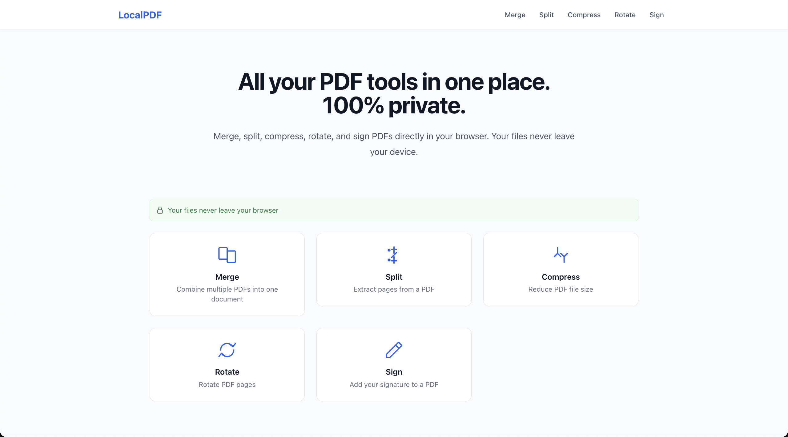
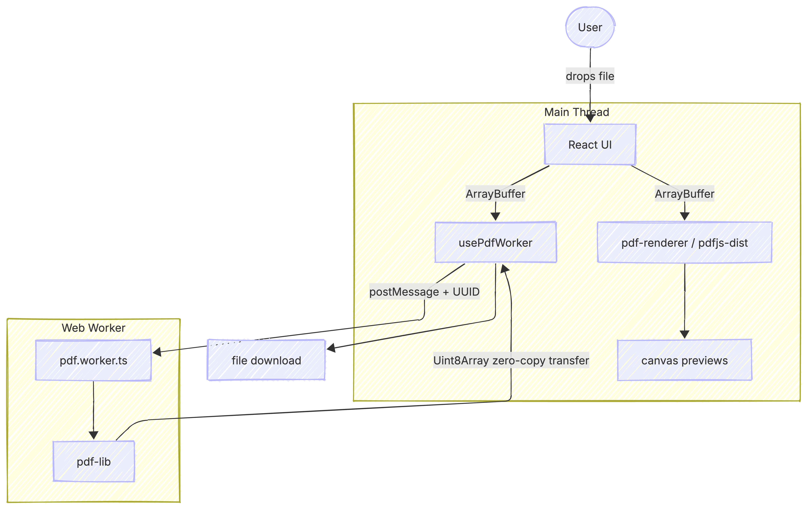

# LocalPDF

**All your PDF tools in one place. Your files never leave your browser.**

A privacy-first PDF toolkit built entirely with client-side Web APIs. No server, no uploads, no tracking — every operation runs locally using a dedicated Web Worker so the UI stays responsive even on large files.

**[localpdf.indirakumar.com](https://localpdf.indirakumar.com)**



---

## Features

| Tool | What it does |
|---|---|
| **Merge** | Combine multiple PDFs with drag-and-drop reordering |
| **Split** | Extract specific pages or page ranges |
| **Compress** | Strip metadata and use object streams to reduce file size |
| **Rotate** | Rotate individual pages independently |
| **Sign** | Draw, upload, or place a signature with pixel-accurate positioning |

---

## Architecture

### Data flow


### Component tree

```
App
└── RouterProvider
    ├── LandingPage
    └── [feature]/Page  (React.lazy — per-route code split)
        ├── PageLayout
        │   ├── Header
        │   └── Footer
        ├── DropZone          ← useFileUpload hook
        ├── PdfThumbnailGrid  ← usePdfDocument + pdf-renderer
        │   └── PdfThumbnail  ← renderPageToCanvas (pdfjs-dist)
        └── [feature controls]
            └── usePdfWorker  ← postMessage bridge to pdf.worker.ts
```

### Key design decisions

**Web Worker for all mutations** — `pdf.worker.ts` handles merge, split, compress, rotate, and sign. The main thread never touches `pdf-lib` directly. Results are transferred as `Uint8Array` using the Transferable Objects protocol (zero-copy buffer handoff).

**Two PDF libraries with distinct roles** — `pdf-lib` manipulates document structure (read/write); `pdfjs-dist` renders pages to `<canvas>` for previews. Mixing them would bloat either path. Vite's `manualChunks` splits them into separate bundle chunks so each is fetched only when needed.

**Promise-based worker abstraction** — `usePdfWorker` tags each request with `crypto.randomUUID()` and resolves the matching promise when the worker replies, giving feature hooks a clean async API without managing raw message events.

**Coordinate system translation in SignaturePlacer** — PDF point origin is bottom-left; canvas origin is top-left. The placer converts screen → PDF coordinates with a Y-axis flip before embedding the image, so signatures land exactly where the user positioned them.

**Pointer Events API for drawing** — `SignatureDraw` uses `setPointerCapture` to track the pointer across the canvas boundary, making the signature pad reliable on mouse, touch, and stylus inputs without separate event handlers.

---

## Tech stack

| Layer | Choice |
|---|---|
| Framework | React 18 + TypeScript |
| Build | Vite 6 (ESM, manual chunks) |
| Routing | React Router v7 (lazy routes) |
| PDF manipulation | pdf-lib 1.17 |
| PDF rendering | pdfjs-dist 4.10 |
| Drag and drop | dnd-kit |
| Styles | Tailwind CSS v3 |

---

## Local setup

**Prerequisites:** Node.js 18+, npm

```bash
# 1. Clone
git clone https://github.com/indirakumarak/localpdf.git
cd localpdf

# 2. Install
npm install

# 3. Start dev server
npm run dev
```

Open [http://localhost:5173](http://localhost:5173).

### Build for production

```bash
npm run build      # outputs to dist/
npm run preview    # serve the production build locally
```

The build produces three main chunks: `index`, `pdf-lib`, and `pdfjs` — the latter two are loaded on demand when the user first uses any PDF tool.

### Project structure

```
src/
├── features/           # one directory per tool
│   ├── merge/          # MergePage, SortableFileList, useMerge
│   ├── split/          # SplitPage, PageSelector, PageRangeInput, useSplit
│   ├── compress/       # CompressPage, CompressionResult, useCompress
│   ├── rotate/         # RotatePage, RotateControls, useRotate
│   └── sign/           # SignPage, SignatureDraw, SignaturePlacer,
│                       # SignatureUpload, SignatureProvider, useSign
├── components/         # shared UI (DropZone, PdfThumbnail, Button…)
├── hooks/              # useFileUpload, usePdfDocument, usePdfWorker
├── lib/                # pdf-renderer.ts, pdf-utils.ts, file-helpers.ts
├── types/              # pdf.ts, worker.ts
├── workers/
│   └── pdf.worker.ts   # handles all pdf-lib operations off main thread
└── routes/index.tsx    # lazy route definitions
```

---

## Deployment

The app is a static SPA. `public/_redirects` routes all paths to `index.html` for client-side routing on Netlify/Cloudflare Pages.

```
/*    /index.html    200
```

No backend required. No environment variables.

---

## License

MIT
